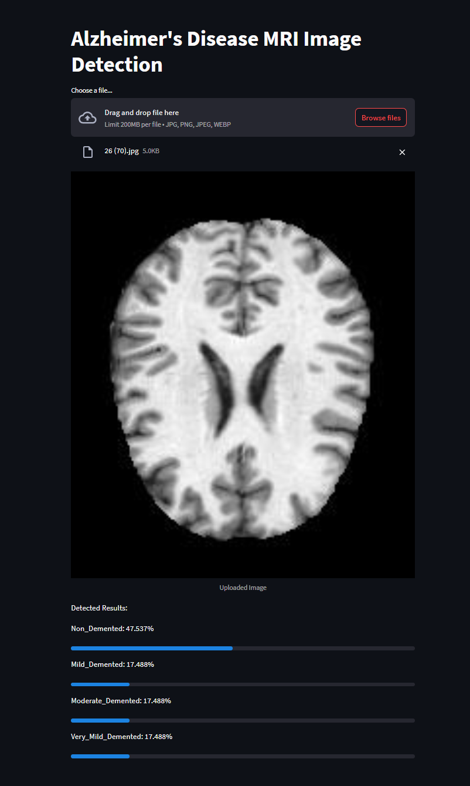

# Alzheimer's Disease Image Detection (Sử dụng cho bài tập lớn TTNTNC)

Đây là một ứng dụng Streamlit để phát hiện bệnh Alzheimer từ các hình ảnh MRI bằng một mô hình CNN đã được huấn luyện trước.

## Yêu cầu tiên quyết

- Python 3.9.13

## Hướng dẫn Cài đặt

### Bước 1: Clone Repository

Đầu tiên, clone repository về máy cục bộ của bạn:

```sh
git clone https://github.com/vinhnado/Alzheimer-s-Disease-Image-Detection.git
cd Alzheimer-s-Disease-Image-Detection
```

### Bước 2: Tạo Môi Trường Ảo (Virtual Environment)

Tạo một môi trường ảo để quản lý các phụ thuộc của dự án:

```sh
python -m venv .venv
```

### Bước 3: Kích Hoạt Môi Trường Ảo

Kích hoạt môi trường ảo:

- **Trên Windows:**

  ```sh
  .venv\Scripts\activate
  ```

- **Trên macOS/Linux:**

  ```sh
  source .venv/bin/activate
  ```

### Bước 4: Cài đặt Các Phụ Thuộc

Với môi trường ảo đã được kích hoạt, cài đặt các phụ thuộc cần thiết:

```sh
pip install -r requirements.txt
```

Nếu bạn không có tệp `requirements.txt`, bạn có thể tạo một tệp mới với các gói cần thiết:

```sh
pip install streamlit tensorflow pillow
pip freeze > requirements.txt
```

### Bước 5: Chạy Ứng Dụng Streamlit

Chạy ứng dụng Streamlit bằng lệnh sau:

```sh
streamlit run app.py
```

Lệnh này sẽ khởi động một máy chủ cục bộ. Mở URL được cung cấp (thường là `http://localhost:8501`) trong trình duyệt web của bạn để truy cập ứng dụng.

### Phát Hiện Ảnh MRI

Tải lên các hình ảnh MRI thông qua giao diện Streamlit để phát hiện bệnh Alzheimer. Ứng dụng sẽ hiển thị hình ảnh đã tải lên và cung cấp kết quả phát hiện chỉ ra xác suất của các giai đoạn khác nhau của bệnh Alzheimer.

## Cấu Trúc Thư Mục

```
.
├── app.py
├── cnn_model.keras
├── requirements.txt
├── TestIMG # Folder for IMG Testing
└── README.md

```

- `app.py`: Kịch bản ứng dụng Streamlit chính.
- `cnn_model.keras`: Mô hình CNN đã được huấn luyện trước được sử dụng để phát hiện hình ảnh.
- `requirements.txt`: Một tệp liệt kê tất cả các phụ thuộc cần thiết để chạy ứng dụng.
- `README.md`: Tệp readme này.

## Gỡ Rối

Nếu bạn gặp bất kỳ vấn đề nào, đảm bảo rằng:
- Bạn đã kích hoạt môi trường ảo.
- Tất cả các phụ thuộc đã được cài đặt đúng cách.
- Tệp `cnn_model.keras` tồn tại trong thư mục dự án.

Hãy tự do mở một vấn đề trong repository nếu bạn cần sự trợ giúp thêm.


## Ảnh ứng dụng:
